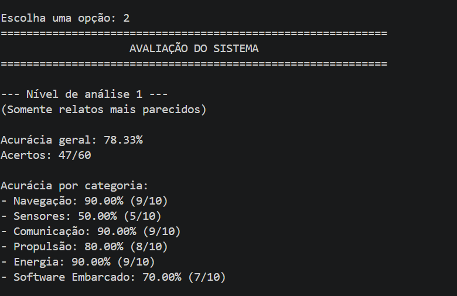
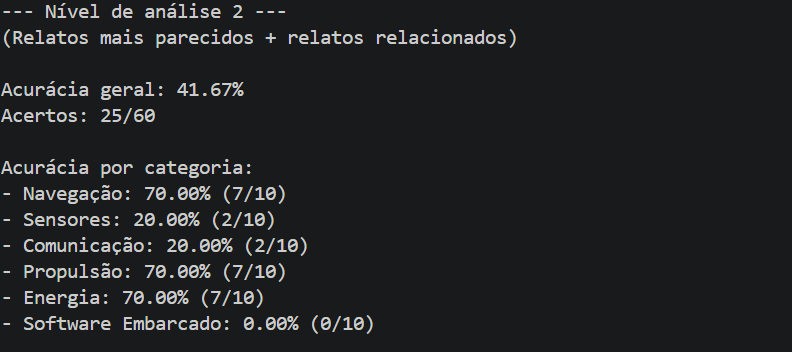
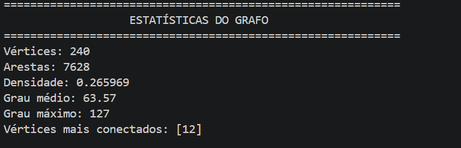

# Trabalho do Grupo 06 — EDA 2

Classificador de falhas de drones usando grafo de similaridade textual e BFS.

## Instalação

```bash
pip install -r requirements.txt
python -m spacy download pt_core_news_sm
```

## Como rodar

```bash
python src/main.py
```

### Comandos disponíveis

- Digite um relato → exibe a categoria predita
- `avaliar` → roda os casos de teste e exibe acurácia
- `sair` → encerra o sistema

## Estrutura

```
src/
  preprocessamento.py   # NLP: tokenização, lematização, Jaccard
  grafo.py              # Estrutura de dados: lista de adjacência
  construcao.py         # Constrói o grafo a partir do dataset
  bfs.py                # BFS implementado do zero
  classificador.py      # Lógica de classificação por similaridade
  main.py               # Interface interativa
dados/
  dataset.json          # 240 relatos de treinamento (80%)
  test_cases.json       # 60 casos de teste (20%)
```

## Análise dos Resultados

# Objetivo da Avaliação

O objetivo da avaliação foi verificar a capacidade do sistema em classificar corretamente relatos de falhas em drones utilizando uma representação em grafo baseada na similaridade textual entre relatos.

A avaliação foi realizada utilizando os casos presentes em `test_cases.json`, comparando a categoria prevista pelo sistema com a categoria esperada para cada relato.

---

## Resultados Obtidos

### Nível de Análise 1

(Somente relatos mais parecidos)

| Categoria          | Acertos |
| ------------------ | ------- |
| Navegação          | 90%     |
| Sensores           | 50%     |
| Comunicação        | 90%     |
| Propulsão          | 80%     |
| Energia            | 90%     |
| Software Embarcado | 70%     |

**Acurácia Geral:** 78,33% (47 acertos em 60 casos)

Os resultados obtidos para o Nível de Análise 1 podem ser observados na imagem abaixo, gerada pelo sistema durante a execução da avaliação. Nela são apresentados a acurácia geral, a quantidade de acertos e o desempenho individual de cada categoria analisada.



---

### Nível de Análise 2

(Relatos mais parecidos + relatos relacionados)

| Categoria          | Acertos |
| ------------------ | ------- |
| Navegação          | 70%     |
| Sensores           | 20%     |
| Comunicação        | 20%     |
| Propulsão          | 70%     |
| Energia            | 70%     |
| Software Embarcado | 0%      |

**Acurácia Geral:** 41,67% (25 acertos em 60 casos)

Os resultados do Nível de Análise 2 podem ser visualizados na imagem abaixo. Nessa configuração, o sistema considera não apenas os relatos mais semelhantes, mas também relatos relacionados encontrados por meio da expansão do grafo, permitindo comparar o impacto dessa estratégia na classificação.



---

## Comparação entre os Modos de Análise

| Modo               | Acurácia |
| ------------------ | -------- |
| Nível de Análise 1 | 78,33%   |
| Nível de Análise 2 | 41,67%   |

Observa-se uma queda significativa de desempenho quando a análise é expandida para relatos relacionados.

Isso indica que os relatos mais semelhantes ao texto analisado possuem maior relevância para a classificação do que os relatos alcançados indiretamente pelo grafo.

---

## Categorias com Melhor Desempenho

As categorias **Navegação**, **Comunicação** e **Energia** apresentaram os melhores resultados no Nível de Análise 1, atingindo 90% de acerto.

Uma possível explicação é que essas categorias possuem vocabulário mais específico e recorrente, contendo termos característicos como:

* Navegação: GPS, satélite, posição, rota, trajetória.
* Comunicação: rádio, telemetria, enlace, sinal, transmissão.
* Energia: bateria, tensão, corrente, carga, autonomia.

Essas palavras tendem a aparecer com menor frequência em outras categorias, facilitando a identificação correta.

---

## Categorias com Maior Dificuldade

A categoria **Sensores** apresentou o menor desempenho.

Isso ocorre porque muitos sensores fazem parte diretamente dos sistemas de navegação, controle e energia do drone, compartilhando diversos termos com essas categorias.

Exemplos observados nos erros:

* Magnetômetro confundido com Navegação.
* Sensor de corrente confundido com Energia.
* Sensores de orientação confundidos com Propulsão.

Essa sobreposição de vocabulário reduz a capacidade discriminativa da similaridade textual.

---

## Impacto da Expansão do Grafo

O Nível de Análise 2 apresentou desempenho inferior ao Nível de Análise 1.

A expansão para relatos relacionados fez com que o algoritmo considerasse vértices que possuíam apenas relação indireta com o relato analisado.

Consequentemente, categorias menos relevantes passaram a influenciar a decisão final, aumentando a quantidade de classificações incorretas.

Esse comportamento indica que, para o conjunto de dados utilizado, os vizinhos diretos fornecem informações mais confiáveis para classificação do que os vizinhos alcançados em níveis mais profundos.

---

## Avaliação da Estrutura em Grafo

A modelagem por grafos permitiu representar relações de similaridade entre relatos de forma intuitiva e eficiente.

Cada vértice representa um relato de falha presente no conjunto de treinamento e cada aresta representa o grau de semelhança entre dois relatos, calculado por meio da Similaridade de Jaccard aplicada aos lemas extraídos durante o pré-processamento textual.

A análise estrutural mostrou que o grafo possui **240 vértices** e **7628 arestas**, evidenciando uma grande quantidade de relações semânticas entre os relatos presentes no dataset.

A densidade obtida foi de **0,265969**, indicando que aproximadamente 26,6% das conexões possíveis entre os vértices estão presentes. Esse resultado demonstra que, embora existam muitas relações entre os relatos, o grafo não é completamente conectado, preservando diferenças importantes entre as categorias.

O **grau médio de 63,57** mostra que cada relato está conectado, em média, a aproximadamente 64 outros relatos. Isso indica que diversos relatos compartilham termos e características semelhantes, permitindo que o algoritmo encontre padrões relevantes para a classificação.

Além disso, foi identificado um vértice com **grau máximo de 127**, correspondente ao vértice **12**, que apresentou o maior número de conexões dentro do grafo. Isso sugere que esse relato contém características comuns a diversos outros relatos presentes na base de dados.

A análise estrutural também justificou o uso da **lista de adjacência** como estrutura de armazenamento. Caso fosse utilizada uma matriz de adjacência, seria necessário armazenar informações para todas as possíveis combinações entre os 240 vértices.

Grande parte dessas posições representaria conexões inexistentes, aumentando desnecessariamente o consumo de memória.

Por outro lado, a lista de adjacência armazena apenas as conexões realmente existentes entre os relatos, reduzindo o uso de memória e tornando mais eficiente a execução da Busca em Largura (BFS), utilizada durante a classificação.

Dessa forma, a combinação entre Similaridade de Jaccard, representação por grafos e lista de adjacência mostrou-se adequada para modelar as relações entre os relatos de falhas e fornecer suporte ao processo de classificação automática.

Os valores de vértices, arestas, densidade e graus apresentados nesta seção podem ser visualizados na imagem abaixo, correspondente à saída gerada pelo sistema durante a análise estrutural do grafo.




---

## Conclusão dos Resultados

Os resultados demonstram que a utilização de grafos para classificação textual é uma abordagem viável para o problema proposto.

O sistema alcançou 78,33% de acurácia utilizando apenas os relatos mais semelhantes ao texto de entrada, demonstrando capacidade de identificar corretamente padrões de falhas em diferentes subsistemas do drone.

Além disso, os experimentos mostraram que expandir excessivamente a busca no grafo pode introduzir ruído e reduzir a precisão das classificações.

Portanto, para este conjunto de dados, o Nível de Análise 1 apresentou o melhor equilíbrio entre simplicidade e desempenho.
